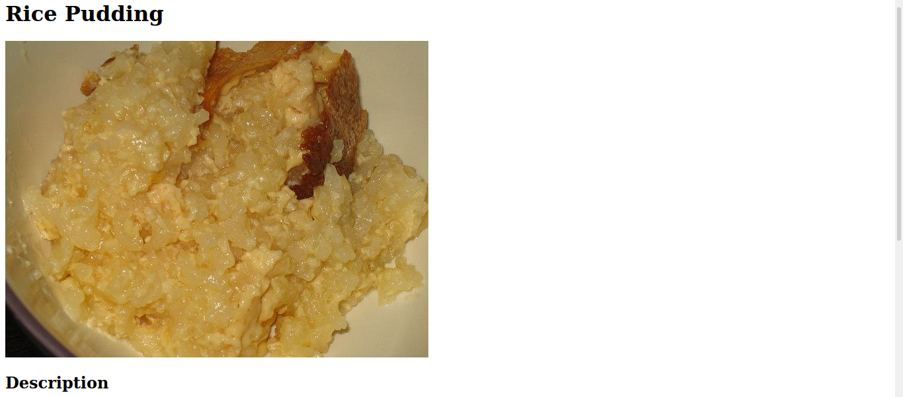

# Readme
# Odin Recipes

## Overview

Elementary project intention with goal of making a HTML website for recipes.

### Challenge

The design requirements which are detailed in the Odin Recipes project page of 
The Odin Project [here](https://www.theodinproject.com/paths/foundations/courses/foundations/lessons/recipes).  

### Screenshot

  

### Links

- [Live site](https://mattdimicelli.github.io/odin-recipes/)
- [Repo](https://github.com/mattdimicelli/odin-recipes)

## My process

### Built with
- HTML

### What I learned
- I focused on the importance of proper markup (since this was HTML only) and what to 
expect from browser default styles.  
- The importance of proper folder structure in website design
- Creating a README.md file was also part of the exercise, so I learned about Markdown doing this.